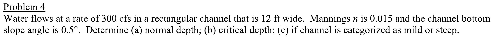
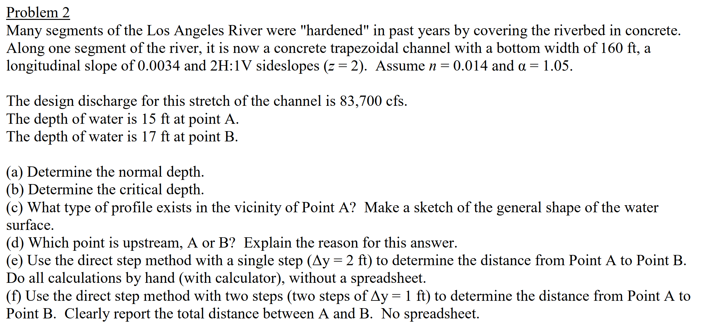

# Rectangular and Trapezoidal Prismatic Open Channel Program

## Description
This program calculates various parameters for prismatic rectangular and trapezoidal open channels. 
For this program, the open channel must be **prismatic**, meaning that the empty channel must have a constant cross-section. 
This program uses US units for all parameters and outputs, meaning lengths and depths **must** be passed in feet, flowrates in cfs, etc. This affects various coefficients like the acceleration due to gravity and the value of *k* in the Manning equation. This also means that calculated areas will be in square feet, calculated depths will be in feet, etc. 

Below are the required and optional inputs for an instance of the class, all of which must be passed when initiating an instance of the class using the constructor 

Required Inputs 
* Bottom width *b* in feet
* Left and right sideslopes *zleft* and *zright* (unitless). *z* is the horizontal distance corresponding to a vertical rise of 1. (i.e. a 2H:1V slope has *z*=2) 
* Manning's *n* (unitless)
* Longitudinal *slope* of the channel as a decimal (i.e. 6% -> 0.06)
* Flowrate *q* in cubic feet per second (cfs) 

Optional Inputs
* Depth *y* of the channel in feet at two points: *y1* and *y2* (cannot be equal). 
* Velocity correction factor *alpha* (assumed to be 1 unless otherwise specified).

Methods
* top(*y*)--calculates the top width *T* of the channel when the water level is at a given depth *y*
* area(*y*)--calculates the water area *A* of the channel when the water level is at a given depth *y*
* wet_perim(*y*)--calculates the wetted perimeter *P* of the channel when the water level is at a given depth *y*
* hyd_rad(*y*)--calcualtes the hydraulic radius *R*, which is defined as *A*/*P*
* norm_depth()--takes no inputs; calculates the normal depth *yn* of the channel for a given flowrate *q* using the Manning Equation
* crit_depth()--takes no inputs; calculates the critical depth *yc* of the channel for a given flowrate *q* by minimizing the specific energy
* downstream()--takes no inputs; determines which point is downstream of the other **if** *y1* and *y2* were passed when the class instance was created
* direct_step(*tograph*)---calculates the distance along the channel between depths *y1* and *y2* if values for both variables were passed when creating the class instance and, optionally if *tograph*=*value* is passed, creates a graph of the water surface and the channel bottom.

## Setup
To use the program, download this repository, create and activate a virtual environment in the local directory, and install the required libraries and their versions. See [Virtual Environments and Packages](https://docs.python.org/3/tutorial/venv.html) for details. 


## Use
_**Note: all example problems copyright of Anne Dudek Ronan, PhD, PE**_

Consider the problem shown below


This problem does not mention the depth at any point so the downstream and direct_step methods cannot be used here.

First create a new instance of the Channel class

```python
>>> ch = Channel(b=12, zleft=0, zright=0, n=0.015, slope=0.0087, q=300)
```

There are a few notes to make here. One, note that zleft=zright=0 because the problem in question is about a rectangular channel, which has no sideslope. Second, note that the slope was passed as 0.0087, which is the value of tan(0.5 deg). 

To find the value of, say, the normal depth, use

```python
>>> print(ch.norm_depth())
```
which returns about 2.04 ft. 

Various other parameters for this channel could be calculated, such as the water area, wetted perimeter, hydraulic radius, and critical depth.

---

Next, consider the problem shown below.


For this problem, all methods, including downstream and direct_step, are available to use. Like above, initiate a class instance using 

```python
>>> ch = Channel(b=160, zleft=2, zright=2, n=0.014, slope=0.0034, q=83700, y1=15, y2=17, alpha=1.05)
```

Note that values were passed for the sideslopes since this is a *trapezoidal* channel, not a rectangular one. Also note that alpha was passed here since a value was given. If nothing is passed for alpha, it is assumed to be equal to 1. 

To calculate the distance between points 1 and 2, which have depths y1 and y2 respectively, use

```python
>>> print(ch.direct_step(tograph=True))
```
which returns a distance of about 1340 ft and a graph of the water surface and channel bottom. To surpress graph printing, pass no value for *tograph* 

If we also wanted to return the cross-sectional area of the water when the depth *y*=15 ft, we could do
```python
>>> print(ch.area(15))
```
which returns an area of 2850 (square feet). 
